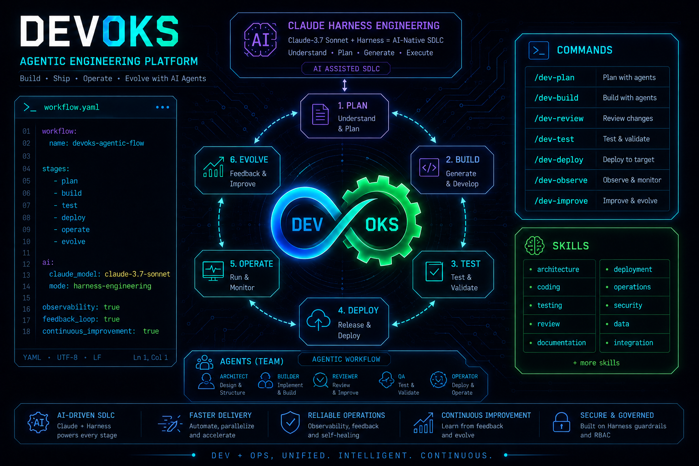

# DevOks Team Harness

Claude Code harness for the DevOks team — plugins for code review, feature development, Git workflows, and React Native debugging.

> **한국어 문서**: [docs/README.ko.md](docs/README.ko.md)
> 
> **MCP & dependency setup**: [`docs/mcp-setup-guide.md`](docs/mcp-setup-guide.md)  
> **Plugin management** (create, validate, deploy): [`docs/plugin-management.md`](docs/plugin-management.md)



---

## Plugin Overview

| Plugin | Contents | Required |
|--------|----------|----------|
| `devoks-core` | Core principles & reference docs — SessionStart hook syncs `rules/` and `refs/` into the project `.claude/` (git-tracked; no longer gitignored) for native auto-loading | **Required** |
| `devoks-git` | Git commit, issue, and PR workflow commands | Recommended |
| `devoks-sdlc` | Unified SDLC workflow — feature dev (FRD/PLAN/execution/UI), test authoring & triage, code review/refactoring/module analysis/security review, requirement & data-flow verification | Recommended |
| `devoks-browser` | Chrome DevTools MCP attach + Visual Diff verification | Optional |
| `devoks-rn` | React Native debugging — Metro DevTools CDP attach, emulator screenshots, JS console/state inspection | Optional (RN projects) |

All plugins except `devoks-core` declare a dependency on `devoks-core` in the marketplace catalog.

Marketplace identifier: **`devoks-plugins`** (install with `@devoks-plugins`). If you previously registered the old `devoks` marketplace, remove it and re-add: `/plugin marketplace remove devoks` → `/plugin marketplace add ridsync/devoks-team-harness`.

---

## Quick Start

```bash
# Prerequisite: gh CLI
brew install gh && gh auth login

# Start a Claude session
claude

# 1. Register marketplace (once)
/plugin marketplace add ridsync/devoks-team-harness

# 2. Install plugins
/plugin install devoks-core@devoks-plugins      # required — syncs rules & refs on session start
/plugin install devoks-git@devoks-plugins       # Git workflow (recommended)
/plugin install devoks-sdlc@devoks-plugins      # SDLC: feature · test · code review/security · verify (recommended)
/plugin install devoks-browser@devoks-plugins   # browser tools (optional)
/plugin install devoks-rn@devoks-plugins        # React Native debugging (optional — RN projects)

# 3. Initialize MCP servers & dependencies (final step)
/devoks-core:setup-mcp
```

> Full dependency & MCP setup → [`docs/mcp-setup-guide.md`](docs/mcp-setup-guide.md)
>
> Update later: `/plugin marketplace update devoks-plugins`

---

## Fallback Installation (`setup.sh`)

Use when the plugin system is unavailable — copies commands, skills, rules, and refs directly into `.claude/`.

```bash
git clone https://github.com/ridsync/devoks-team-harness.git
cd /path/to/your-project
/path/to/devoks-team-harness/setup.sh

# update
/path/to/devoks-team-harness/setup.sh --update
```

> **Note:** `setup.sh` copies static files but does not run the `devoks-core` SessionStart hook. Re-run `setup.sh --update` after pulling harness changes to refresh rules and refs.

---

## How `devoks-core` Context Sync Works

On session start (`startup`, `resume`, `clear`, `compact`), the `devoks-core` hook runs `sync-context.sh` and:

1. Copies bundled `plugins/devoks-core/rules/*.md` → `.claude/rules/` (overwrites when the bundle changed)
2. Copies bundled `plugins/devoks-core/refs/*.md` → `.claude/refs/` (overwrites when the bundle changed)

**Policy:** The plugin bundle is the SSOT for these rules/refs, so the hook keeps each project's copy in sync with the bundle. It only copies the bundled files — project-specific files in those folders (e.g. `pitfalls.md`) are never touched. The hook does **not** modify `.gitignore`; projects track and commit `.claude/rules/` and `.claude/refs/` in git.

| Type | Files | Role |
|------|-------|------|
| **rules** | `agent-principles`, `project-convention`, `memory-policy` | Always-on agent behavior |
| **refs** | `code-review`, `engineering-principles`, `git-convention`, `workflow` | On-demand reference docs |

No slash command is needed — Claude Code loads `.claude/rules/` natively.

---

## Available Skills

| Skill | Invoke | Plugin |
|-------|--------|--------|
| `feature-frd-author` | `/devoks-sdlc:feature-frd-author` | devoks-sdlc |
| `feature-plan-author` | `/devoks-sdlc:feature-plan-author` | devoks-sdlc |
| `feature-plan-executor` | `/devoks-sdlc:feature-plan-executor` | devoks-sdlc |
| `feature-workflow-runner` | `/devoks-sdlc:feature-workflow-runner` | devoks-sdlc |
| `verify-requirements` | `/devoks-sdlc:verify-requirements` | devoks-sdlc |
| `verify-data-flow` | `/devoks-sdlc:verify-data-flow` | devoks-sdlc |
| `code-review` | `/devoks-sdlc:code-review` *(agent-internal only)* | devoks-sdlc |
| `code-security-review` | `/devoks-sdlc:code-security-review` *(agent-internal only)* | devoks-sdlc |
| `test-author` | `/devoks-sdlc:test-author` | devoks-sdlc |
| `test-run-triage` | `/devoks-sdlc:test-run-triage` | devoks-sdlc |
| `browser-devtools` | `/devoks-browser:browser-devtools` | devoks-browser |
| `browser-visual-diff` | `/devoks-browser:browser-visual-diff` | devoks-browser |
| `metro-devtools-attach` | `/devoks-rn:metro-devtools-attach` | devoks-rn |

## Available Agents

| Agent | Plugin | Delegated by |
|-------|--------|--------------|
| `code-reviewer` | devoks-sdlc | `code-review-general`, `code-review-diff-branch` commands |
| `code-security-reviewer` | devoks-sdlc | `code-security-review` command |
| `browser-visual-diff-capture` | devoks-browser | `browser-visual-diff` skill (Phase 1–4) |

---

## Available Commands

### devoks-git

| Command | Description |
|---------|-------------|
| `/devoks-git:git-commit-msg` | Generate Conventional Commits message |
| `/devoks-git:git-create-issue` | Create a GitHub issue |
| `/devoks-git:git-pull-request` | Create a PR (CODEOWNERS-based reviewer assignment) |

### devoks-sdlc

| Command | Description |
|---------|-------------|
| `/devoks-sdlc:new-feature-draft` | Spec-driven feature implementation |
| `/devoks-sdlc:new-feature-github-issue` | GitHub issue-driven feature implementation |
| `/devoks-sdlc:new-ui-draft` | Figma → code UI implementation |
| `/devoks-sdlc:code-review-general` | Scoped code review |
| `/devoks-sdlc:code-review-diff-branch` | Branch diff code review |
| `/devoks-sdlc:code-security-review` | Repo / dependency / threat-level security review |
| `/devoks-sdlc:code-refactoring` | Structure, contract, and quality refactoring |
| `/devoks-sdlc:code-analyze-module` | Module / business logic analysis |

---

## Dependency Summary

> DevOks plugins do **not** bundle general-purpose MCP servers (Figma, Playwright, Serena, CodeGraph, context7). Install them once at **user/project scope** to avoid duplicate instances and conflicts with your local MCP setup. The `devoks-core` SessionStart hook (`hooks/check-mcp.sh`) detects missing servers each session and prints install guidance. **Exceptions:** `devoks-browser` bundles only `chrome-devtools-attach` (`:9269` attach-specific config). `devoks-rn` requires `metro-devtools` in `~/.claude.json` with a dynamic `--wsEndpoint` (Metro WebSocket URL changes on restart). See [`docs/mcp-setup-guide.md`](docs/mcp-setup-guide.md) → "설치 정책".

| Plugin | Required | Optional |
|--------|----------|----------|
| devoks-core | — | — |
| devoks-git | `gh` CLI | — |
| devoks-sdlc | `gh` CLI, CodeGraph MCP, Serena MCP | Figma MCP, context-mode MCP |
| devoks-browser | Chrome DevTools MCP + `~/.claude.json` | Playwright MCP, Figma MCP |
| devoks-rn | `devoks-rn` plugin + Metro running; `metro-devtools` in `~/.claude.json` (dynamic `--wsEndpoint`) | `adb` / `xcrun simctl` (screenshots) |

Full setup guide → [`docs/mcp-setup-guide.md`](docs/mcp-setup-guide.md)

---

## Directory Structure

```
devoks-team-harness/
├── .claude-plugin/marketplace.json    # marketplace catalog
├── plugins/
│   ├── devoks-core/
│   │   ├── hooks/                     # SessionStart → sync-context.sh
│   │   ├── rules/                     # SSOT: agent-principles, project-convention, memory-policy
│   │   └── refs/                      # SSOT: code-review, engineering-principles, git-convention, workflow
│   ├── devoks-git/commands/           # Git commands (3)
│   ├── devoks-sdlc/                    # SDLC: feature·test·code·verify (8 commands + 10 skills + 2 agents)
│   ├── devoks-browser/               # browser tools (2 skills + 1 agent)
│   └── devoks-rn/                    # React Native debugging (1 skill)
├── shared/
│   ├── setup/claude.json.template     # ~/.claude.json MCP config template
│   └── templates/CLAUDE.md.project.template
├── docs/
│   ├── README.ko.md                   # Korean README
│   ├── mcp-setup-guide.md             # MCP dependency setup
│   ├── plugin-management.md           # plugin create · validate · deploy workflow
│   └── roadmap.md                     # future improvements (TODO)
├── setup.sh                           # fallback install script
└── README.md
```

> `plugins/devoks-core/rules/` and `plugins/devoks-core/refs/` are the SSOT for team principles and reference docs. Edit those files and commit — the SessionStart hook (or `setup.sh`) syncs them into each project's `.claude/`. Projects keep these copies git-tracked (the hook does not gitignore them).

---

## Roadmap

Planned plugin structure & content improvements are tracked in [`docs/roadmap.md`](docs/roadmap.md) (TODO format). Highlights: migrate `browser-visual-diff` → `devoks-sdlc:verify-visual-diff`, add a `devoks-release` plugin for the Deploy/Release phase, auto-generate the catalog tables to prevent README drift, and consolidate the severity rubric to a single SSOT.

---

## Contributing

1. Fork this repository.
2. Edit `plugins/devoks-core/rules/`, `plugins/devoks-core/refs/`, or plugin files.
3. Open a PR.
4. After merge, teammates run `/plugin marketplace update devoks-plugins` to refresh.
