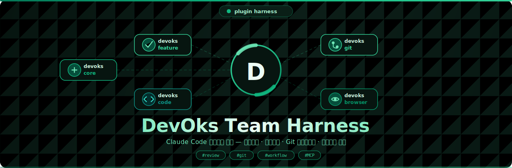

# DevOks Team Harness

DevOks 팀 Claude Code 하네스 — 코드리뷰·기능개발·Git 워크플로우 플러그인 모음.

> **의존성 및 MCP 설치 가이드**: [`docs/mcp-setup-guide.md`](docs/mcp-setup-guide.md)  
> **플러그인 관리 가이드** (생성·검증·배포): [`docs/plugin-management.md`](docs/plugin-management.md)



---

## 플러그인 구성

| 플러그인 | 내용 | 필수 여부 |
|---------|------|----------|
| `devoks-core` | 기본 원칙 컨텍스트 (Agent Principles, Project Convention, Memory Policy) | **필수** |
| `devoks-git` | Git 커밋·이슈·PR 워크플로우 커맨드 | 권장 |
| `devoks-feature` | 기능개발 워크플로우 (FRD·PLAN·실행 스킬, UI 구현, 검증) | 권장 |
| `devoks-code` | 코드리뷰·리팩토링·모듈분석 커맨드 | 권장 |
| `devoks-browser` | Chrome DevTools MCP 연결 + Visual Diff 검증 | 선택 |

---

## 빠른 시작 (최소 의존성)

```bash
# 필수: gh CLI 설치
brew install gh && gh auth login

# 1. 마켓플레이스 등록 (최초 1회)
/plugin marketplace add ridsync/devoks-team-harness

# 2. 설치
/plugin install devoks-core@devoks
/plugin install devoks-git@devoks
/plugin install devoks-feature@devoks
/plugin install devoks-code@devoks
```

전체 의존성 설치는 → [`docs/mcp-setup-guide.md`](docs/mcp-setup-guide.md)

---

## 플러그인 설치 (Claude Code 플러그인 시스템)

### 1단계: 마켓플레이스 등록 (최초 1회)

```bash
/plugin marketplace add ridsync/devoks-team-harness
```

### 2단계: 플러그인 설치

```bash
/plugin install devoks-core@devoks           # 필수
/plugin install devoks-git@devoks            # Git 워크플로우
/plugin install devoks-feature@devoks        # 기능개발
/plugin install devoks-code@devoks           # 코드 품질
/plugin install devoks-browser@devoks        # 브라우저 도구 (선택)
```

### 3단계: 업데이트

```bash
/plugin marketplace update devoks
```

---

## 폴백 설치 (setup.sh)

```bash
git clone https://github.com/ridsync/devoks-team-harness.git
cd /path/to/your-project
/path/to/devoks-team-harness/setup.sh

# 업데이트
/path/to/devoks-team-harness/setup.sh --update
```

---

## 사용 가능한 스킬

| 스킬 | 호출 | 플러그인 |
|------|------|---------|
| `devoks-core-rules` | `/devoks-core-rules` | devoks-core |
| `devoks-frd-author` | `/devoks-frd-author` | devoks-feature |
| `devoks-plan-author` | `/devoks-plan-author` | devoks-feature |
| `devoks-plan-executor` | `/devoks-plan-executor` | devoks-feature |
| `devoks-feature-workflow-runner` | `/devoks-feature-workflow-runner` | devoks-feature |
| `devoks-data-verification` | `/devoks-data-verification` | devoks-feature |
| `devoks-chrome-devtools-mcp-attach` | `/devoks-chrome-devtools-mcp-attach` | devoks-browser |
| `devoks-visual-diff-verification` | `/devoks-visual-diff-verification` | devoks-browser |

---

## 사용 가능한 커맨드

### devoks-git
| 커맨드 | 설명 |
|--------|------|
| `/devoks-git-commit-msg` | Conventional Commits 커밋 메시지 생성 |
| `/devoks-git-create-issue` | GitHub 이슈 생성 |
| `/devoks-git-pull-request` | PR 생성 (CODEOWNERS 기반 리뷰어 할당) |

### devoks-feature
| 커맨드 | 설명 |
|--------|------|
| `/devoks-new-feature-draft` | 스펙 기반 기능 구현 |
| `/devoks-new-feature-github-issue` | GitHub 이슈 기반 기능 구현 |
| `/devoks-new-feature-verify` | 구현 전후 체크리스트 + 커버리지 검증 |
| `/devoks-new-ui-draft` | Figma → 코드 UI 구현 |

### devoks-code
| 커맨드 | 설명 |
|--------|------|
| `/devoks-code-review-general` | 범위 지정 코드리뷰 |
| `/devoks-code-review-diff-branch` | 브랜치 diff 기반 코드리뷰 |
| `/devoks-code-refactoring` | 구조·계약·품질 리팩토링 |
| `/devoks-code-analyze-module` | 모듈/비즈니스 로직 분석 |

---

## 의존성 요약

| 플러그인 | 필수 | 선택 |
|---------|------|------|
| devoks-core | — | — |
| devoks-git | `gh` CLI | — |
| devoks-feature | `gh` CLI | Figma MCP, context-mode MCP |
| devoks-code | CodeGraph MCP, Serena MCP | context-mode MCP |
| devoks-browser | Chrome DevTools MCP + `~/.claude.json` | Playwright MCP, Figma MCP |

전체 설치 가이드 → [`docs/mcp-setup-guide.md`](docs/mcp-setup-guide.md)

---

## 디렉토리 구조

```
devoks-team-harness/
├── .claude-plugin/marketplace.json    # 마켓플레이스 카탈로그
├── plugins/
│   ├── devoks-core/skills/            # devoks-core-rules 스킬 (Agent Principles 등)
│   ├── devoks-git/commands/           # Git 커맨드 (3개)
│   ├── devoks-feature/                # 기능개발 (커맨드 4개 + 스킬 5개)
│   ├── devoks-code/commands/          # 코드 품질 (4개)
│   └── devoks-browser/skills/         # 브라우저 도구 (2개)
├── shared/
│   ├── rules/                         # SSOT: agent-principles, project-convention, memory-policy
│   ├── refs/                          # SSOT: code-review, engineering-principles, git-convention, workflow
│   ├── setup/claude.json.template     # ~/.claude.json MCP 설정 템플릿
│   └── templates/CLAUDE.md.project.template
├── docs/
│   ├── mcp-setup-guide.md             # MCP 의존성 설치 가이드
│   └── plugin-management.md           # 플러그인 생성·검증·배포 워크플로우
├── setup.sh                           # 폴백 설치 스크립트
└── README.md
```

> `shared/rules/` 와 `shared/refs/` 가 SSOT입니다. 규칙 변경 시 이 파일들과 `plugins/devoks-core/skills/devoks-core-rules/SKILL.md` 를 함께 수정하고 커밋하세요.

---

## 기여 방법

1. 이 저장소를 fork 합니다.
2. `shared/rules/`, `shared/refs/`, 또는 플러그인 파일을 수정합니다.
3. PR을 올립니다.
4. 머지 후 팀원은 `/plugin marketplace update devoks` 로 갱신합니다.
