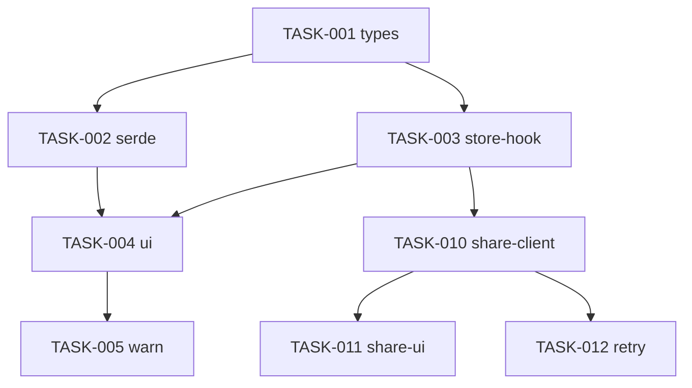

# 예시 워크스루 (도메인 중립) — FRD → PLAN

> 추적성·`[P]` 병렬·PR 분리가 실제로 어떻게 채워지는지 보여주는 짧은 1건 예시.
> 도메인 의존이 없는 "저장된 필터 뷰 + 공유" 기능으로 시연한다. 형식 참고용일 뿐 그대로 베끼지 않는다.

---

## 입력 — 거친 FRD 초안 (사용자가 전달)

> "목록 화면에 자주 쓰는 필터 조합을 '뷰'로 저장하고 다시 적용할 수 있게 하고 싶어요.
> 저장한 뷰를 팀원과 공유도 되면 좋고. 저장 뷰의 필터 키가 더 이상 없으면 깨지지 않게."

---

## 정련된 FRD (발췌)

### 3. Requirements (EARS)

REQ-001: 필터 뷰 저장·적용
- `AC-001-1` WHEN 사용자가 현재 필터 조합을 '뷰로 저장'하고 이름을 입력 THE SYSTEM SHALL 해당 조합을 뷰 목록에 저장한다.
- `AC-001-2` WHEN 사용자가 저장된 뷰를 선택 THE SYSTEM SHALL 그 필터 조합을 목록에 즉시 적용한다.
- `AC-001-3` IF 저장된 뷰의 필터 키가 현재 스키마에 없으면 THEN THE SYSTEM SHALL 그 키를 무시하고 경고를 노출한다.

REQ-002: 뷰 공유
- `AC-002-1` WHEN 사용자가 뷰의 '공유'를 켜면 THE SYSTEM SHALL 공유 링크를 발급하고 팀에 노출한다.
- `AC-002-2` IF 공유 링크 발급이 실패하면 THEN THE SYSTEM SHALL 실패를 안내하고 뷰는 비공개로 유지한다.

### 4. Design Spec (발췌)

**4.2 컴포넌트 구조**
- `SavedViews` — 뷰 목록·저장·선택 UI. 뷰 목록 상태를 소유.
  - 저장 버튼 / 뷰 선택 드롭다운 / 미존재 키 경고 토스트(조건부 렌더링)

**4.3 적용 패턴 (DSN)**
| ID | 설계 결정 | 근거 (프로젝트 패턴/제약) |
|----|-----------|---------------------------|
| DSN-001 | 뷰 저장/조회는 기존 저장소 훅 패턴을 재사용 | 상태관리 SSOT |
| DSN-002 | 필터 직렬화/역직렬화를 순수 유틸로 분리 | 테스트 용이성·관심사 분리 |

### 5.1 Contract
| ID | 항목 | 타입/범위 | 기본값 | 의미 |
|----|------|-----------|--------|------|
| CTR-001 | `viewName` | string, 1..40자 | — | 뷰 식별 이름(중복 불가) |
| CTR-002 | `maxViewsPerUser` | number, 0..50 | 20 | 사용자별 저장 뷰 상한 |

### 8. Edge Cases
| ID | 상황 | 기대 동작 |
|----|------|-----------|
| EDGE-001 | 저장 뷰 상한 초과 | 저장 차단 + 안내, 기존 뷰 삭제 유도 |
| EDGE-002 | 공유 API 타임아웃 | 재시도 1회 후 실패 시 비공개 유지 |

---

## 도출된 PLAN (발췌)

### 1. Approach
- **요약:** 필터 직렬화/역직렬화 유틸 + 뷰 저장소 훅으로 저장·적용을 구현하고, 공유는 별도 흐름으로 분리.
- **PR 분리:** PR1 = 뷰 저장·적용(로컬), PR2 = 뷰 공유(서버 연동).

### 3. Tasks

#### PR1 — 필터 뷰 저장·적용
- [ ] `TASK-001` 뷰 타입/상수 정의(`viewName`, 상한) — file: `src/.../views.types.js` — traces: CTR-001, CTR-002
- [ ] `TASK-002` [P] 필터 직렬화/역직렬화 + 미존재 키 필터링 유틸 + 테스트 — file: `src/.../filterSerde.js` — traces: AC-001-3, CTR-001, DSN-002
- [ ] `TASK-003` 뷰 저장소 훅(저장/조회/상한 검증) + 테스트 — file: `src/.../useSavedViews.js` — traces: AC-001-1, CTR-002, EDGE-001, DSN-001
- [ ] `TASK-004` 뷰 저장/선택 UI + 적용 연동 — file: `src/.../SavedViews.jsx` — traces: AC-001-1, AC-001-2
- [ ] `TASK-005` 미존재 키 경고 토스트(조건부) — file: `src/.../SavedViews.jsx` — traces: AC-001-3

#### PR2 — 뷰 공유
- [ ] `TASK-010` 공유 링크 발급 클라이언트 + 테스트 — file: `src/.../shareView.js` — traces: AC-002-1
- [ ] `TASK-011` 공유 토글 UI + 실패 시 비공개 유지 — file: `src/.../SavedViews.jsx` — traces: AC-002-1, AC-002-2
- [ ] `TASK-012` 공유 API 타임아웃 재시도(1회)·폴백 — file: `src/.../shareView.js` — traces: EDGE-002

### 4. Dependencies

---

## 이 예시가 보여주는 것

- **커버리지 누락 0**: FRD의 AC-001-1~3, AC-002-1~2, CTR-001/002, EDGE-001/002 가 모두 어떤 Task의 `traces`에 등장한다.
- **설계 추적(DSN)**: DSN-001/002 가 PLAN traces에 참조로 등장한다 — 단, 누락 0 강제 대상은 AC/CTR/EDGE 뿐이고 DSN은 참조용이다.
- **`[P]`**: TASK-002는 TASK-001(타입)만 의존하고 TASK-003과 서로 무관 → 병렬 착수 가능.
- **PR 분리**: PR2(공유)는 PR1의 저장소 훅(TASK-003)에 단방향 의존. 역방향 의존 없음.
- **증분성**: 타입 → 유틸/훅(+테스트) → UI → 결과/에러 순으로 쌓여 각 단계가 독립 검증 가능.
