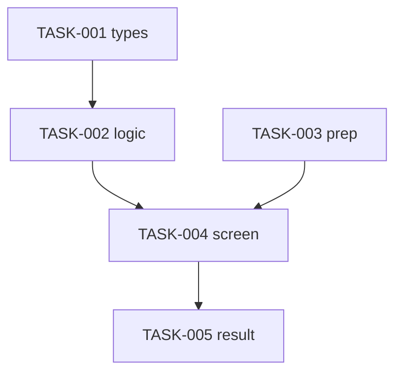

# 태스크 분해 · 병렬 마커 · PR 분리

> FRD를 "실행 가능한 단위"로 쪼개는 규칙. 잘못된 분해는 거대 PR·교착·되돌리기 비용으로 돌아온다.

## Task 분해 3원칙

1. **단일(Single)** — 한 Task = 한 관심사. "구현 + 테스트 + 문서"를 한 줄에 묶지 않는다(테스트는 로직 Task에 동반 가능).
2. **검증가능(Verifiable)** — 완료를 객관적으로 판정할 수 있다. `traces`의 AC/CTR로 "됐다"를 증명한다.
3. **증분적(Incremental)** — 머지해도 시스템이 깨지지 않는 크기. 기본은 타입/상수 → 로직 → UI → 결과/에러 순으로 쌓는다.

권장 크기: 한 Task는 한 자리에서 구현·검증 가능한 정도(대략 파일 1~3개). 그보다 크면 쪼갠다.

## Task ID·필드 형식

```
- [ ] TASK-001 [P?] <설명> — file: <경로> — traces: <ID들>
```

- `TASK-` + 3자리 숫자. PR 경계마다 10단위로 띄우면(PR1: 001~, PR2: 010~) 끼워넣기 여유가 생긴다.
- `file:` 는 신규/수정 대상 경로. 미정이면 디렉터리까지라도 적는다.
- `traces:` 는 필수(→ `traceability.md`).

## `[P]` 병렬 마커

선행 Task의 산출물에 **의존하지 않는** Task에만 `[P]`를 붙인다. 같은 파일을 동시에 만지는 Task는 `[P]`가 아니다(충돌).

- 판단 기준: "이 Task를 지금 시작해도, 아직 안 끝난 다른 Task의 결과가 필요 없는가?" → 예면 `[P]`.
- 예: 타입 정의(TASK-001) 직후, 순수 계산 훅(TASK-002 [P])과 정적 화면 스캐폴드는 병렬 가능. 단 둘을 합치는 Task는 직렬.

## PR 분리 기준

하나의 PR = **독립적으로 리뷰·머지·롤백 가능한 가치 단위**. 다음 경계에서 끊는다.

- **기능 축**: 사용자가 인지하는 독립 기능 단위(예: PR1 핵심 자동 흐름 / PR2 사용자 피드백 흐름).
- **위험 축**: 되돌리기 위험이 다른 변경은 분리(스키마/마이그레이션 vs UI).
- **리뷰 부담**: 변경이 너무 커 한 번에 리뷰가 어렵다면 의존성 그래프의 자연 절단면에서 분리.
- **의존 방향**: PR2는 PR1의 머지를 전제로 할 수 있으나, 순환 의존은 금지. PR 간 의존은 단방향.

> "One Task, One Unit" — 여러 관심사를 한 PR에 묶지 않는다. 단, 너무 잘게 쪼개 PR이 무의미해지지도 않게.

## 의존성 그래프

PLAN §4에 mermaid `flowchart TD`로 Task 간 선후를 명시한다. 화살표 = "먼저 끝나야 함".



- `[P]` Task는 들어오는 화살표가 없거나 같은 선행만 공유한다(서로를 가리키지 않음).
- 그래프에 사이클이 있으면 분해가 틀린 것 — 공유 의존을 별도 선행 Task로 추출한다.
- PR 분리선과 그래프가 모순되면 안 된다: PR2의 Task가 PR1의 Task에 의존하는 건 OK, 그 반대는 금지.
