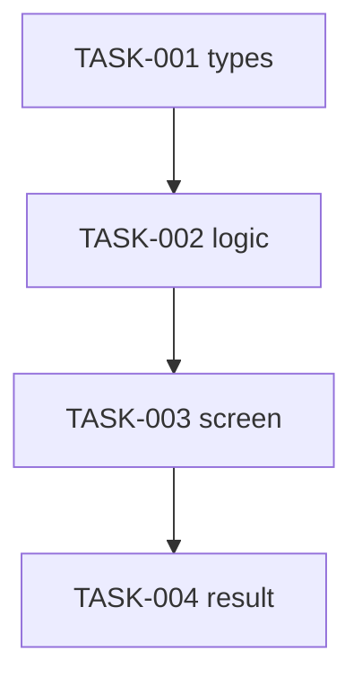

# Plan — <기능 이름>

> `FRD.md`의 요구사항을 실행 가능한 Task로 분해.
> 규칙: 단일·검증가능·증분적 / 파일 경로 명시 / 의존성 없으면 `[P]` / `traces`로 역추적 / 테스트 먼저.
> (Coverage Matrix는 생략하고, 각 Task의 `traces`로 대체 — 검증법은 `references/traceability.md`)

## 1. Approach
- **요약:** <구현 방식 1~2문장>
- **PR 분리:** <기본은 PR 1개. 분리한다면 근거(기능/위험/리뷰 부담 중 하나)와 PR 구성을 명시 — 기준: `references/task-pr-splitting.md`>

## 2. Resource Check (착수 전)
> FRD §6에서 가져옴. 미완료 시 시작 금지.
- [ ] 참고 코드 접근 (`<훅/유틸>`)
- [ ] 외부 워크플로 문서 확인 (`<doc>`)
- [ ] 시안 export / 세팅 키 확인

## 3. Tasks
> 형식: `- [ ] TASK-ID [P?] 설명 — size: <S|M|L> — test: <required|skip> — file: <경로> — traces: <REQ/AC/CTR/EDGE>`
> `traces`에 `DSN-xxx`(설계 결정)도 인용 가능 — 참조용이며 커버리지 누락 0 강제 대상은 아니다(`references/traceability.md`).
> `[P]` = 선행 Task에 의존하지 않아 병렬 착수 가능. 상태 추적: `references/progress-tracking.md`
> `size` = 실행 라우팅 신호(S 직접 / M 위임 / L 분해 재검토) — 부여 기준: `references/task-pr-splitting.md`, 라우팅: `references/task-delegation.md`
> `test` = 테스트 필요 여부(required 기본값 / skip) — 부여 기준: `references/task-pr-splitting.md`. `code-implementer`는 사용자 확인 없이 이 마커를 그대로 따른다.

### PR1 — <핵심 작업>
- [ ] `TASK-001` 공유 타입/상수 정의 — size: S — test: skip — file: `<경로>` — traces: CTR-001
- [ ] `TASK-002` [P] 계산 로직 훅/유틸 — size: M — test: required — file: `<경로>` — traces: CTR-001, REQ-001
- [ ] `TASK-003` 화면/라우트 + 상태 처리 — size: M — test: required — file: `<경로>` — traces: REQ-001, AC-001-1
- [ ] `TASK-004` 결과/조건부 렌더링 — size: S — test: required — file: `<경로>` — traces: AC-001-2

<!-- PR을 나눌 근거(기능/위험/리뷰 부담)가 §1에 명시됐을 때만 PR2 이상을 추가한다 — 기준: `references/task-pr-splitting.md`.
### PR2 — <두 번째 큰 작업>
- [ ] `TASK-010` <...> — size: M — test: required — file: `<경로>` — traces: REQ-002
- [ ] `TASK-011` 에러/재시도 처리 — size: S — test: required — file: `<경로>` — traces: EDGE-002
-->

## 4. Dependencies

## 5. Definition of Done
- [ ] 모든 Task 완료
- [ ] 모든 `REQ`/`AC`/`CTR`/`EDGE` 가 Task `traces`로 커버됨 (누락 0)
- [ ] 핵심 비즈니스 로직 테스트 통과(정상/경계/실패, 안티패턴 없음 — 기준: `skills/test-author/references/test-quality-bar.md`)
- [ ] Edge case 처리 확인
